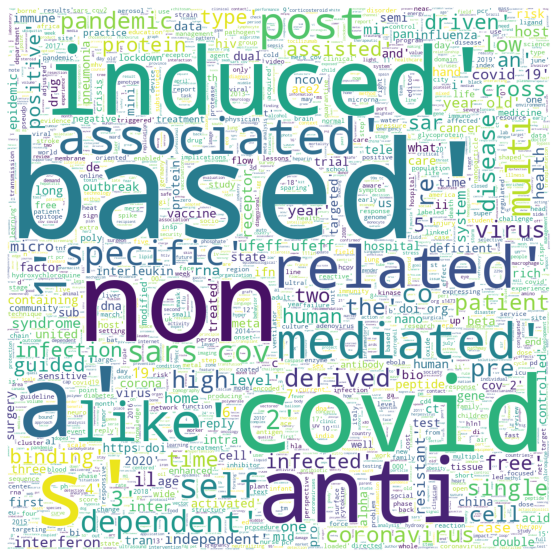
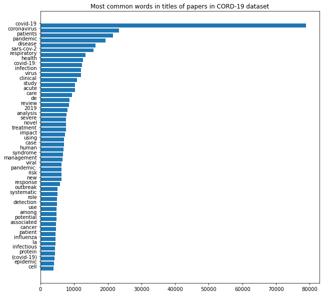
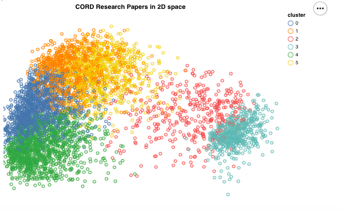
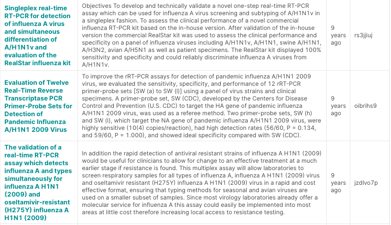

# COVID-19-NLP-Literature-Analysis-
Developing NLP tools for understanding vast amount of Published COVID -19 literature. Developed CBOW (Word2Vec Model) to quickly help answer questions about the virus from vast literature available like:   • Incubation Time • Survival time on different surfaces • Effective Drug treatments

